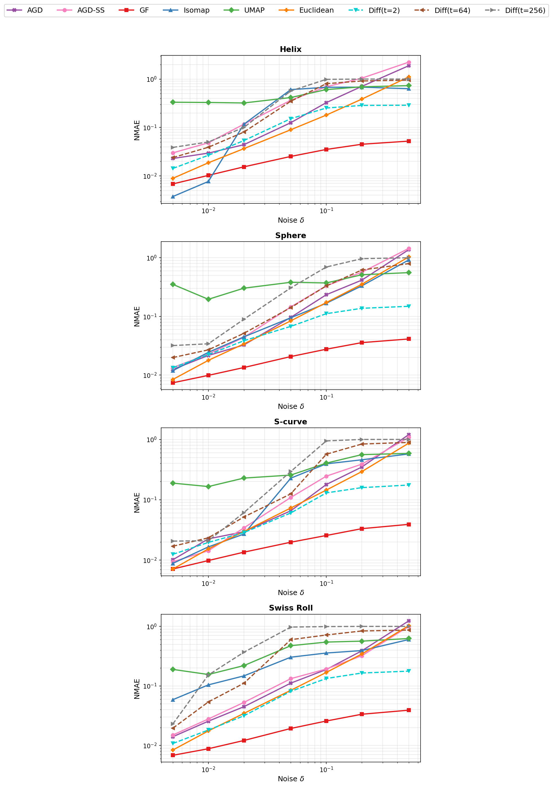

**Figure 1.** Normalized Mean Absolute Error (NMAE) of pairwise distance estimates under additive Gaussian noise on the four synthetic manifolds from the paper (Helix, Sphere, S-curve, Swiss Roll; $N=500$ points each). For each noise level $\delta$ in $\lbrace 0.005, 0.01, 0.02, 0.05, 0.1, 0.2, 0.5 \rbrace$, independent Gaussian noise $\varepsilon_i \sim \mathcal{N}(0, \delta^2 I)$ is added to every point, all pairwise distances are re-estimated, and NMAE is computed relative to the clean distance matrix:

$$\mathrm{NMAE} = \frac{\sum_{i<j} |\hat{d}_{\delta}(i,j) - \hat{d}_{0}(i,j)|}{\sum_{i<j} \hat{d}_{0}(i,j)}.$$

Both axes are on a log scale.
